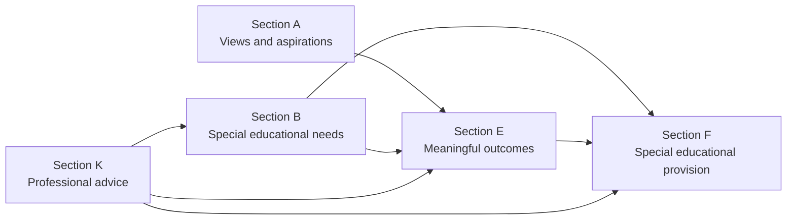
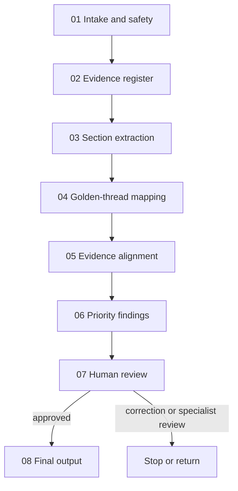

# EHCP Golden Thread Editor

> A parent-built, critique-only editor that helps families examine whether a draft Education, Health and Care Plan faithfully connects needs, outcomes and provision.

[](https://github.com/stadeuk85/EHCP-Golden-Thread-Editor/actions/workflows/validate.yml)

## Why I built it

My son is autistic, and like many families in England we were expected to review a complex statutory document without specialist support. Parents are often asked to trust that a draft EHCP is complete, accurate and properly reflects the professional evidence. Small omissions, vague wording or broken links between needs and provision can directly affect the support a child receives.

The EHCP Golden Thread Editor was created to make that review more structured, transparent and manageable. It does not replace parents, professionals, local authorities or legal advisers. It helps a human reviewer see exactly what the draft says, what the evidence says and where the connection may have broken.

## The competition idea

This entry treats an AI editor as an **editor, not a rewriter**.

It follows five core behaviours:

1. quote the exact passage;
2. identify one precise defect;
3. explain the practical consequence;
4. show the evidence or authority relied upon;
5. return a bounded revision task, not replacement wording.

## What it reviews

The editor concentrates on the EHCP golden thread:



It tests whether:

- Section B records the individual functional educational needs shown in the supplied evidence;
- Section E contains meaningful and observable outcomes linked to needs and aspirations;
- Section F specifies provision for every identified Section B need;
- professional recommendations are included accurately, weakened, omitted, contradicted or unclear;
- each need, outcome and provision item forms a defensible thread;
- uncertainty, missing reports and professional conflicts remain visible.

## What it will not do

- write a corrected EHCP;
- invent hours, frequencies, staffing, diagnoses, outcomes or recommendations;
- decide legal entitlement, placement, appeal grounds or remedies;
- treat a warning phrase as automatically unlawful;
- conceal disagreement between professional reports;
- make an automated statutory decision;
- silently apply proposed SEND reforms as current law.

## Try the competition demonstration

Open [`demo/index.html`](demo/index.html) in a browser. It uses a completely synthetic example and shows:

- the B to E to F mapping;
- the three-priority-findings approach;
- evidence alignment;
- the difference between critique and rewriting;
- the mandatory human-review gate.

No document is uploaded and no personal data is processed by the demonstration.

## Standard invocation

```text
Run the EHCP Golden Thread Editor.

Jurisdiction: England
Document stage: amended draft
Review Sections B, E and F.
Prioritise the three most serious findings.
Compare the plan with the supplied professional evidence.
Quote the exact wording.
Explain the defect and why it matters.
Give revision tasks, not replacement wording.
State where evidence is missing or uncertain.
```

## The original five-part editor remains intact

The competition remit is still immediately visible and usable:

| Required part | One clear job |
|---|---|
| [`identity.md`](identity.md) | Defines who the editor is, what it reviews, its England jurisdiction and its boundaries |
| [`rules.md`](rules.md) | Teaches the editor how to critique specifically without rewriting or inventing evidence |
| [`examples.md`](examples.md) | Shows weak feedback, strong feedback and prohibited rewriting |
| [`reference/`](reference/) | Holds stable EHCP checklists, evidence methods, authority hierarchy, safety guidance and output contracts |
| [`README.md`](README.md) | Lets a stranger understand, install and invoke the editor |

A user can stop at these five parts and use the editor in the way the competition describes.

## What the later ICM Architect skill adds

After the competition began, the ICM Architect skill became available. It was used to add a governed architecture around the original editor without changing its critique-only remit:

- a compact skill trigger and cold-start map;
- explicit workspace and folder contracts;
- eight numbered review stages;
- visible stage outputs and hand-offs;
- a copied private case-run template;
- a mandatory human-release gate;
- schema validation, synthetic evaluations and release evidence.

The repository is therefore both a clean competition editor and an example of how the editor can evolve into a traceable, resumable workflow.

## Governed ICM workflow

The repository is structured so a reviewer or agent can recover workflow state from explicit artefacts rather than hidden reasoning.



| File or folder | Purpose |
|---|---|
| [`SKILL.md`](SKILL.md) | Skill trigger, route and non-negotiable controls |
| [`AGENTS.md`](AGENTS.md) | Cold-start map for a new reviewer or agent |
| [`CONTEXT.md`](CONTEXT.md) | Repository workspace and state model |
| [`FILE-MAP.md`](FILE-MAP.md) | ICM layer map and complete navigation aid |
| [`workflows/`](workflows/01_ehcp-golden-thread-review/CONTEXT.md) | Ordered stage contracts and hand-offs |
| [`reference/`](reference/) | Legal, editorial and evidence-review methodology |
| [`templates/`](templates/review-run-template/) | Blank private review-run structure |
| [`evals/`](evals/) | Synthetic fixtures and evaluation approach |
| [`demo/`](demo/) | Public competition demonstration |
| [`_release/`](_release/current/) | Release manifest and validation evidence |

## Output

A completed review provides:

1. an editorial verdict and material limitations;
2. up to three highest-impact findings;
3. golden-thread breaks using stable A, B, E and F IDs;
4. an evidence-alignment table;
5. unresolved evidence and clarification needs;
6. specific strengths worth preserving;
7. a recorded human-review decision;
8. a final self-check.

The human-readable contract is in [`reference/output-schema.md`](reference/output-schema.md). The machine-readable JSON Schema is in [`reference/output-schema.json`](reference/output-schema.json).

## Safety and privacy

EHCPs may contain children’s personal data, health information and family circumstances. Real case material must not be committed to this public repository.

The minimum controls include:

- remove unnecessary identifiers;
- use an approved secure processing environment;
- apply least-privilege access;
- define retention and deletion rules;
- keep credentials server-side;
- log access and material human decisions;
- complete appropriate information-governance assessment and DPIA work;
- require a human review before statutory use.

See [`reference/privacy-and-safety.md`](reference/privacy-and-safety.md).

## Legal framing

The editor is limited to England. It distinguishes:

- statutory duties;
- regulations;
- statutory guidance;
- professional evidence;
- local policy;
- internal consistency;
- editorial good practice.

The authority register was reviewed on **22 July 2026** and points only to official sources. Live use must recheck current official versions. See [`reference/authority-register.json`](reference/authority-register.json).

## Validation

Run:

```bash
python -m pip install -r requirements-dev.txt
python tools/validate_repo.py
```

The GitHub Actions workflow checks:

- the five original competition components;
- required ICM entry and folder contracts;
- all eight stage contracts;
- JSON parsing;
- the machine-readable response schema;
- a synthetic valid-output fixture;
- legal-authority and release records;
- the core critique-only controls;
- the no-upload public demo boundary.

## Status

**Competition release: v1.1.0, 22 July 2026**

This is a transparent methodology and governed prototype. It is not legal advice, a statutory decision system or a production platform for identifiable case records.
